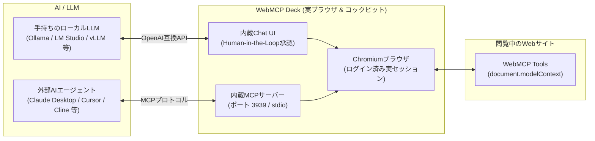

# WebMCP Deck

> **WebMCP Client & Live Browser for AI Agents**  
> Chromium標準のWebMCP（`document.modelContext` / `navigator.modelContext`）を人間が普段使いできるデスクトップブラウザに統合。  
> **「手持ちのローカルLLMを接続してWebMCPを手軽に試す」** ことも、**「外部AIエージェントからMCP経由で実ブラウザを直接コントロールする」** ことも可能な、AI時代のハイブリッドWebクライアントです。



---

## 🎯 2つの主要な使い方

### 1. 手持ちのローカルLLMと接続してWebMCPをすぐ試す
Ollama、LM Studio、vLLM、llama.cpp など、手元で動いているローカルLLM（OpenAI互換エンドポイント）を指定するだけで、WebMCP対応サイトを即座に操作・テストできます。

* **APIキー不要・完全ローカル動作**: 外部クラウドにデータを送信せず、ローカルLLMの推論のみで安全にWebMCPツールを呼び出せます。
* **モデル自動検出**: Base URL（例: `http://localhost:11434/v1`）を入力して「取得」ボタンを押すと、ロードされているモデル一覧を自動取得して選択できます。
* **すぐに試せる内蔵デモ**: アプリ内にWebMCP対応のデモサイト（ホテル予約・ECカート等）を同梱しており、外部サイトを用意しなくてもすぐにツール呼び出しや対話フローを体験できます。
* **Human-in-the-Loop（安全承認）**: 予約確定や注文などの副作用を伴うアクションは、実行前に人間が承認・拒否できる安全機構を備えています。

### 2. MCPサーバーとして外部AIエージェントからコントロールする
WebMCP Deck 自体が **MCP (Model Context Protocol) サーバー** としてバックグラウンドで動作します。

* **Claude Desktop や Cursor から実ブラウザを操作**: 普段使っているエージェントにWebMCP DeckのMCPサーバーを登録するだけで、現在ブラウザで開いているWebページのWebMCPツール群がエージェントのツールとして自動的に露出します。
* **Headlessブラウザの「ログイン・CAPTCHAの壁」を解決**: ユーザーがWebMCP Deck上で事前にログイン（2要素認証含む）を済ませたセッションをそのまま外部エージェントが操作できるため、自動化が困難だったWebサービスも透過的に扱えます。
* **1クリック設定コピー**: 設定画面（⚙️）の「MCP連携」タブから、Claude Desktop用やCursor用の設定JSONをワンクリックでコピーして貼り付けるだけでセットアップ完了です。

---

## 📦 インストール方法

### macOS (Homebrew Cask)
```bash
brew tap blue1st/taps
brew install --cask webmcp-deck
```

### Windows
[GitHub Releases](https://github.com/blue1st/webmcp-deck/releases) から最新の `WebMCP-Deck-Setup-*.exe` をダウンロードして実行してください。

---

## 🌟 主な機能

### 1. 実用的なモダンブラウザ機能
* **スマートアドレスバー**: URL直接入力（自動補完）とGoogle検索キーワードを自動判定。
* **Chrome ブックマーク直接連携**: ローカルのChromeお気に入りを自動検出し、ヘッダーの「★」から瞬時に検索・ジャンプ。
* **ホームページURL設定**: お好みのサイト（Google、GitHub、社内ポータル等）をホームに指定可能。
* **ネイティブ右クリックメニュー**: コピー、貼り付け、要素の検証（Inspect Element）をフルサポート。

### 2. MCP サーバー機能（外部AIツール向けプロキシ）
* WebMCP Deck 自体がローカルの **MCP サーバー** として動作（デフォルトポート `3939` / SSE & stdioブリッジ）。
* **Claude Desktop** や **Cursor** から、WebMCP Deck で開いているWebページのツールを透過的に呼び出し。
* 設定画面（⚙️）の「MCP連携」タブから設定JSONを1クリックでコピー可能。

### 3. サイト別スキル管理＆高速マクロ実行
* LLMと対話して実行したツールの操作履歴を、引数を変数化した「スキル」として1クリック保存。
* 開いているサイト（ドメイン）ごとのフィルタリング、誤削除防止付きの削除機能を搭載。
* 次回以降はLLM推論をスキップして爆速で一括実行。

### 4. 2ペイン・コックピットUI
* **左ペイン (Browser)**: 実ブラウザ画面。
* **右ペイン (Cockpit)**:
  * **Chat**: ローカルLLMと対話しながらページ上のタスクを実行（Human-in-the-Loop対応）。
  * **Inspector**: ページが公開しているWebMCPツールの定義一覧とフォームからの手動実行テスト。
  * **Skills**: 保存したサイト別自動化マクロの管理・実行。

---

## 🛠️ 開発・ビルド

```bash
# 依存パッケージのインストール
npm install

# 開発モード起動
npm run dev

# プロダクションビルド
npm run build

# パッケージング (ローカルテスト)
npm run dist:mac  # macOS (DMG & ZIP)
npm run dist:win  # Windows (EXE & ZIP)
```

---

## 🚀 リリース手順 (メンテナー向け)

本プロジェクトは `release-it` と GitHub Actions を利用してタグプッシュ時に macOS（Apple Silicon & Intel）と Windows 向けのインストーラーを自動生成・公開します。

```bash
# バージョンアップ & タギング & リモートプッシュ
npm run release
```
GitHub Actions により自動でビルドが走り、GitHub Releases へのアセット公開および `blue1st/homebrew-taps` への Cask 自動更新が実行されます。
